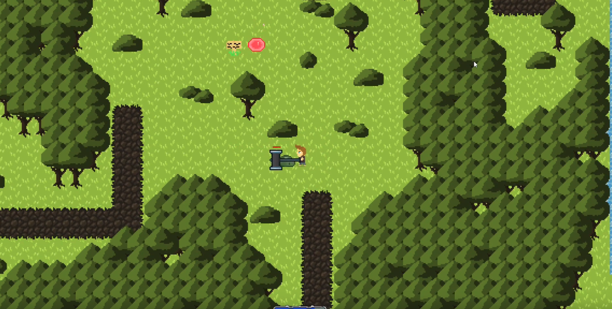

# ArchipeloClient
Official repository for the ArchipeloClient!

Archipelo is a project created to be a simple MMO that can be played on any device. It is built with the LibGDX game engine in Java. Due to lack of time, Archipelo has been cancelled.



<h3>License</h3>
This project is under the MIT License. Please see the LICENSE file for more details.

<h3>Not Accepting Pull-requests</h3>
For the sake of preservation, we are not accepting pull requests onto this repository. If you wish to modify the code, we suggest you fork this repository so that you will not have limited access.

<h3>Known Bugs</h3>

* Game rendering is blurry when moving  (Upon further investigation, it seems all pixel art games have this issue)
* Collisions are unpredictable if y < 0
* Player does not render if 3 tiles from the top of a chunk
* Underscore/hyphen characters are switched in the Bitmap Font

### Running the Game

NOTE: This is NOT recommended. The project's gradle configuration is old and requires an older version of Java. The Archipelo server is also very difficult to set up since it requires an active login server (service has been shutdown). It is encouraged that you use this code in a separate project or just look at it for your pleasure.

To play the game properly, you must first set up a [server](https://github.com/hollowbit/archipeloserver).

To run the client, simply execute

```
$ ./gradlew run
```
